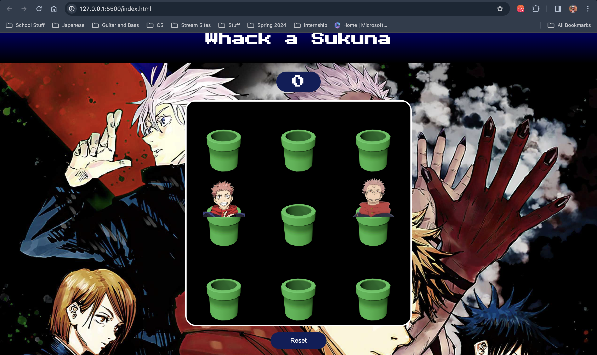

# Whack-a-Sukuna Game
# cmps3350-lab05
group project

## Description
Using HTML, CSS, and JavaScript, we have built this Whack-a-Mole game based off of the anime, Jujutsu Kaisen. The game "Whack-a-Sukuna" is played by seeing which players can score the highest by only hitting Sukuna with their cursor. there is a score tracker at the top of the screen which increments by 10 points for every sakuna that is hit. try to set a highscore and beat your friends using our leaderboard.

## Features
- Classic Whack-a-Mole gameplay
- Score tracking

## Technologies Used
- HTML
- CSS
- JavaScript

## Installation
1. Clone the repository: `git clone https://github.com/l-135/cmps3350-lab05.git`
2. Navigate to the project directory.
3. Open `index.html` in your preferred web browser.

## How to Play
- Click on the moles (Sukuna) as they appear to earn points.
- Avoid clicking on Yuji Itadori, as the game will end.
- each sukuna hit is equal to 10 points
- once the gane ends you can enter your initials to see how you did
  compared to other players
- players have the option to retry as many times as they want.

## Contributing
Contributions are welcome! Please follow these steps:
1. Fork the project.
2. Create your feature branch: `git checkout -b feature/my-feature`.
3. Commit your changes: `git commit -am 'Add some feature'`.
4. Push to the branch: `git push origin feature/my-feature`.
5. Submit a pull request.

## Credits
- Created by [Luis Gomez](https://github.com/l-135) and [Blessing Aung](https://github.com/baung10)
- Inspiration from [Kenny Yip Coding](https://github.com/ImKennyYip)
